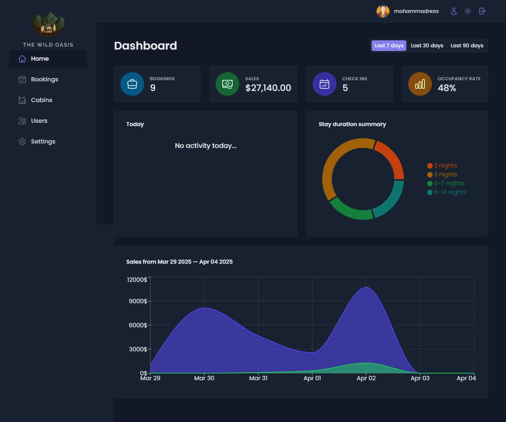

# The Wild Oasis

This is the advanced and final project of React Jonas' course on Udemy.

## React + Vite

## 🏨 Hotel Management Dashboard

A **hotel management dashboard** that allows **managing users, cabins, and reservations**. This project includes **CRUD operations** and uses **Supabase** for data management.

### 🚀 Technologies Used:

- ⚛ [**React**](https://react.dev/) – JavaScript framework for building UI
- 🔄 [**React Query**](https://tanstack.com/query/latest) – Server state management and data caching
- 💅 [**Styled Components**](https://styled-components.com/) – CSS-in-JS for component styling
- 🗄 [**Supabase**](https://supabase.com/) – Database and authentication management

### 📌 Features:

- Manage users, cabins, and reservations
- **Create, Read, Update, Delete (CRUD)** operations
- Connects to Supabase for data storage
- Caching for improved performance using React Query

### 📷 Screenshot

